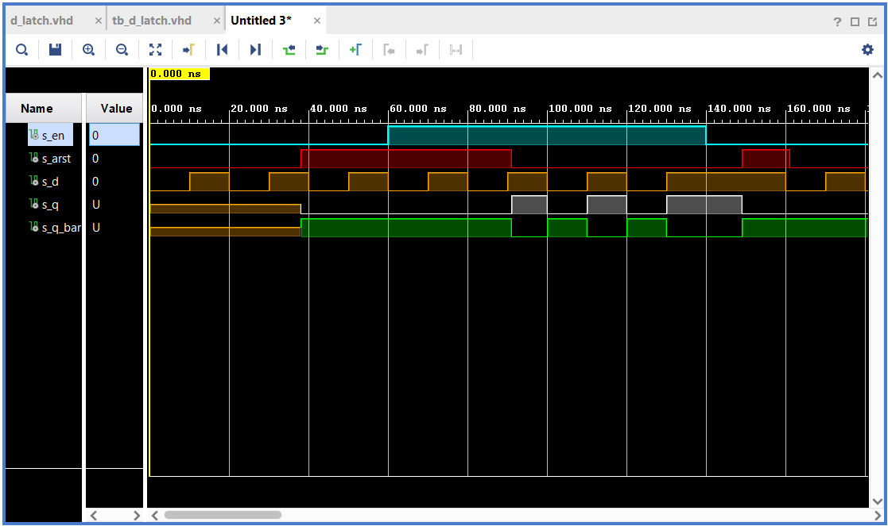

# Lab assignment 07- Latches and Flip-flops

Link to my repository: [tmarcak/Digital-electronics-1](https://github.com/tmarcak/Digital-electronics-1)

## 1. Preparation tasks 

### Characteristic equations and completed tables for D, JK, T flip-flops


| **clk** | **d** | **q(n)** | **q(n+1)** | **Comments** |
| :-: | :-: | :-: | :-: | :-- |
|  | 0 | 0 | 0 | No change |
|  | 0 | 1 | 0 | Store |
|  | 1 | 0 | 1 | Store |
|  | 1 | 1 | 1 | No change |

| **clk** | **j** | **k** | **q(n)** | **q(n+1)** | **Comments** |
| :-: | :-: | :-: | :-: | :-: | :-- |
|  | 0 | 0 | 0 | 0 | No change |
|  | 0 | 0 | 1 | 1 | No change |
|  | 0 | 1 | 0 | 0 | Reset |
|  | 0 | 1 | 1 | 0 | Reset |
|  | 1 | 0 | 0 | 1 | Set |
|  | 1 | 0 | 1 | 1 | Set |
|  | 1 | 1 | 0 | 1 | Toggle |
|  | 1 | 1 | 1 | 0 | Toggle |

| **clk** | **t** | **q(n)** | **q(n+1)** | **Comments** |
| :-: | :-: | :-: | :-: | :-- |
|  | 0 | 0 | 0 | No change |
|  | 0 | 1 | 1 | No change |
|  | 1 | 0 | 1 | Invert(Toggle) |
|  | 1 | 1 | 0 | Invert(Toggle) |

## 2. D latch

### VHDL code of the process (`p_d_latch`)

```vhdl
  p_d_latch : process (d, arst, en)
  begin
      if (arst = '1') then
          q     <= '0';
          q_bar <= '1';
            
      elsif (en = '1') then
          q     <= d;
          q_bar <= not d;
      end if;
  end process p_d_latch;
```
### VHDL code of the reset and stimulus processes from the testbench file (`tb_d_latch.vhd`)

```vhdl
  p_reset_gen : process
  begin
      s_arst <= '0';
      wait for 38 ns;
        
      -- Reset activated
      s_arst <= '1';
      wait for 53 ns;
        
      s_arst <= '0';
      wait for 58 ns;
        
      -- Reset activated
      s_arst <= '1';
      wait for 12 ns;
        
      s_arst <= '0';
      wait;
  end process p_reset_gen;


  p_stimulus : process
  begin
      report "Stimulus process started" severity note;
        
      s_d  <= '0';
      s_en <= '0';
      wait for 10 ns;
        
      --remember/hold values 
      s_d  <= '1';
      wait for 10 ns;
      s_d  <= '0';
      wait for 10 ns;
      s_d  <= '1';
      --reset set to 1 
      wait for 10 ns;
      s_d  <= '0';
      wait for 10 ns;
      s_d  <= '1';
      wait for 10 ns;
    
      --Reseting output q
      s_d  <= '0';
      s_en <= '1';
      assert ((s_arst = '0') and (s_en = '1'))
      report "s_en setted to one -> Resetting output q" severity note;	
      wait for 10 ns;
        
      --Seting output q 
      s_d  <= '1';
      assert ((s_arst = '0') and (s_en = '1'))
      report "s_en setted to one -> Setting output q" severity note;	
      wait for 10 ns;
          
      s_d  <= '0';
      wait for 10 ns;   
      s_d  <= '1';
      wait for 10 ns;
      s_d  <= '0';
      wait for 10 ns;
      s_d  <= '1';
      --reset set to 0 - again operating 
      wait for 10 ns;
      s_d  <= '0';
      wait for 10 ns;
      s_d  <= '1';
      wait for 10 ns;
    
    
      -- Remember/hold values 
      s_en <= '0';
      assert ((s_arst = '0') and (s_en = '0'))
      report "s_en setted to zero -> remember/hold value" severity note;
      wait for 10 ns;
        
      s_d  <= '1';
      wait for 10 ns;
      s_d  <= '0';
      wait for 10 ns;
      s_d  <= '1';
      wait for 10 ns;
      s_d  <= '0';
      wait for 10 ns;
      s_d  <= '1';
      --reset set to 1 - all values should be '0'
      wait for 10 ns;
      s_d  <= '0';
      wait for 10 ns;
      s_d  <= '1';
      wait for 10 ns;
      s_d  <= '0';
        
      report "Stimulus process finished" severity note;
      wait;
  end process p_stimulus;
```

### Screenshot with simulated time waveforms



## 3. Flip-flops

### VHDL code listing of the processes (`p_d_ff_arst`), (`p_d_ff_rst`), (`p_jk_ff_rst`), (`p_t_ff_rst`)


