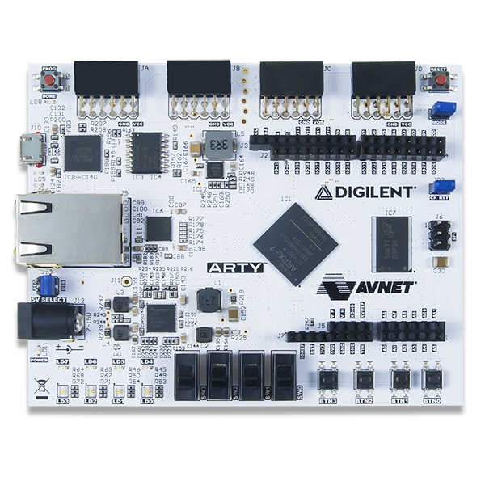
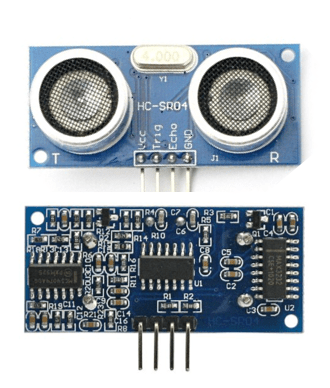
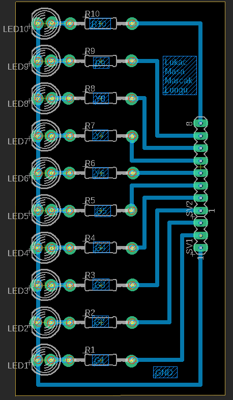
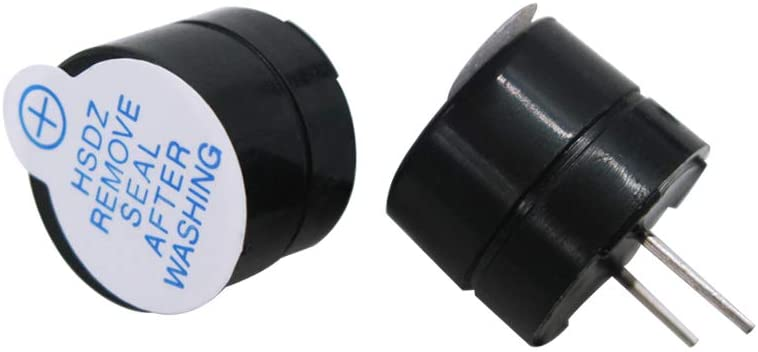
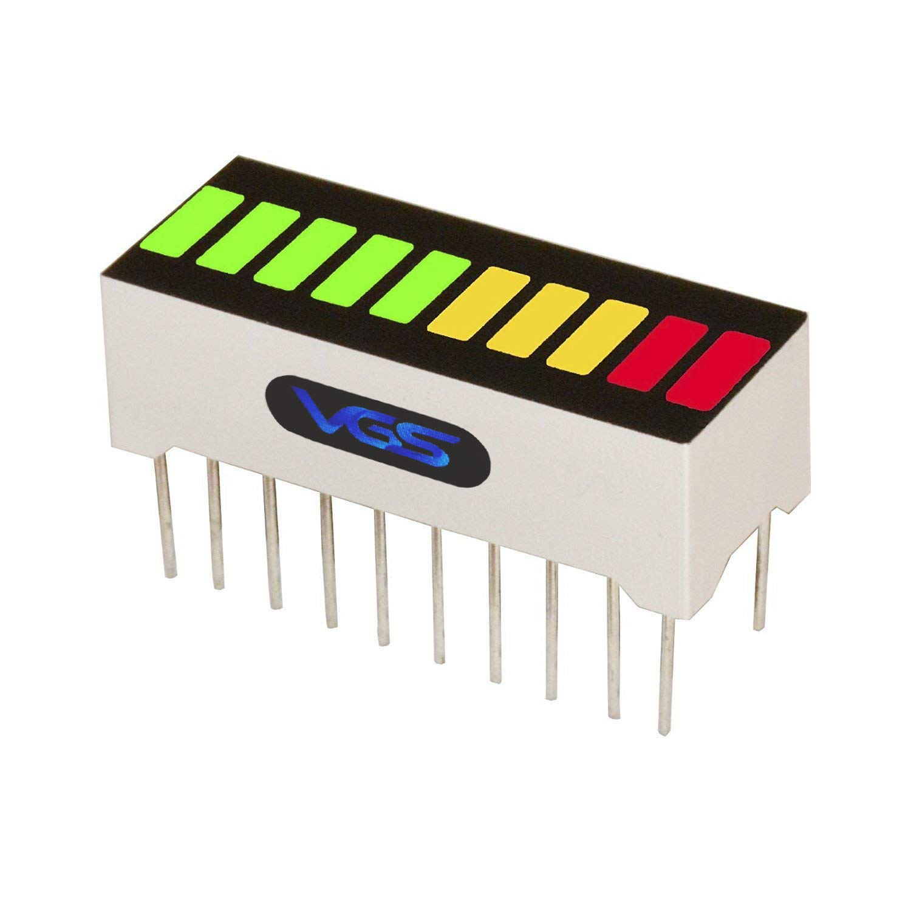

# DE1 Project assignment - Parking assistant

### Team members
Vladimír Lukáč, Masauso Lungu, Tomáš Marčák, Vít Maša

Link to our GitHub project folder: [Project folder](https://github.com/Masauso-L/Digital-electronics-1/tree/main/Project)

### Project objectives

Main objective of the project from the subject Digital electronic was to create a parking assistant with HC-SR04 ultrasonic sensor, sound signaling using PWM, signaling by LED bargraph and this all controled by Arty A7. The sensor measures a distance from 2cm to 4m, but in our project we used measurements only up to 1,5m. All codes, testbenches and simlation are created in Vivado. Desingnes of boards are created in Autodesk Eagle.

# Hardware description

### Arty A7

The Arty A7, formerly known as the Arty, is a ready-to-use development platform designed around the Artix-7™ Field Programmable Gate Array (FPGA) from Xilinx.
It was designed specifically for use as a MicroBlaze Soft Processing System. When used in this context, the Arty A7 becomes the most flexible processing platform you could hope to add to your collection, capable of adapting to whatever your project requires. 
The Arty A7 is fully compatible with the high-performance Vivado ® Design Suite. It is supported under the free WebPACK™ license, so designs can be implemented at no additional cost. [1]

We wanted to use Pmod connectors, but they have only 3.3V VCC and HC-SR04 need to be powered by 5V. So we decided to use Arduino/chipKIT Shield Connector which has two pins with 3.3V VCC and 5.0V VCC outputs.

### HC-SR04 ultrasonic sensor

The HC-SR04 ultrasonic sensor uses sonar to determine distance to an object like bats do. 
It offers excellent non-contact range detection with high accuracy and stable readings in an easy-to-use package. 
It comes complete with ultrasonic transmitter and receiver modules. This sensor is very popular among the Arduino tinkerers. [2]
The sensor expects 10us long pulses, based on which it sends ultrasonic pulses and rigesters their reflection. The sensor returnt an acho pulse with a width corresponding to the distance of blockade from the sensor. Conversion for distance is : echo pulse length / 58. Distance is in cm.

As it is mentioned above, the sensor must be powered by 5V, so we chose to use Arduino/chipKIT Shield Connector which have pin with 5V, so we can powered the sensor from this pin.

### Board

Our designed board in Eagle software. 

### Buzzer
For sound signalization with PWM we chose simple Piezo Buzzer. 
Piezo buzzers are simple devices that can generate basic beeps and tones.  
They work by using a piezo crystal. It is a special material that changes shape when voltage is applied to it.  
If the crystal pushes against a diaphragm, like a tiny speaker cone, it can generate a pressure wave which the human ear picks up as sound.  
Simple change the frequency of the voltage sent to the piezo and it will start generating sounds by changing shape very quickly!

### LED bargraph
As visual signalization we chose 10 segment LED bargraph, where are 5 green segment which signalizated there is lots of free space (1,5m - 0,5m), 3 yellow segment (0,5m - 0,2m) and 2 red segments (0,2m - 0m) which signalizated there is not enought space and you have to stop or you can crash your car. We decided to make first green LED glow when car distance is between 1,5m and 1,2m and second if you reach 1,2m because you have to let 1,2m space when you are parking next to car for handicapped.

### Pin cables

## VHDL modules description and simulations

### HC-SR04 Ultrasonic sensor

The sensor control is divided into two blocks `Sensor_contro_unit` and `Sensor_logic_unit`.

### Sensor_control_unit

The `Sensor_control_unit` module directly controls the HC-SR04 sensor. It emits an appropriately long pulse and calculates the response.
### Sensor_logic_unit

The `Sensor_logic_unit` module controls when the pulse is sent to the sensor and processes the returned distance. Module converts returned distance to 10 levels, which are sent to `Buzzer_control_unit` and `LED_bar_control_unit` modules.

### Buzzer

### Buzzer_control_unit

The `Buzzer_control_unit` module has 3 inputs and one output. First input is enable signal which determines if module is functional or not. Second input is distance level from `Sensor_logic_unit` represented by 4-bit logic vector. Third input is a 100MHz clock signal. The output is PWM modulated waveform for piezo buzzer. Architecture of module is created by two sequentinal processes. First process `p_clk` secured clock and second process `p_buzzer` make PWM modulation. First it checks if enable signal is ON and when it is ON then it determines distance level and starts appropriate couter with proper pulse width.

### LED bar graph

### LED_bar_control_unit

The `LED_bar_control_unit` module has 2 inputs and 1 output. First input is enable signal, which determines if module is functional or not. Second input is distance level from `Sensor_logic_unit` represented by 4-bit logic vector. The output is 10-bit logic vector, 1-bit for 1 level of distance, which is send to LED bar graph. Process in this module is simple. First it checks if enable signal is ON and when it is ON then determine distance level and light up the specific LEDs. If enable signal is OFF then it switch OFF all the LEDs.

# TOP module description and simulations

## Top module diagram

## Video

*Write your text here*

## References

   1. Arty A7 board description. In: digilentinc.com [online]. Available here: [Arty A7](https://reference.digilentinc.com/reference/programmable-logic/arty-a7/reference-manual) 
   2. HC-SR04 ultrasonic sensor description. In: randomnerdtutorials.com [online]. Available here: [HC-SR04](https://randomnerdtutorials.com/complete-guide-for-ultrasonic-sensor-hc-sr04/) 
   3. LED bar grapg image. In: amazon.com [online]. Available here: [LED bar graph](https://www.amazon.com/Single-Segment-Display-Colors-Arduino/dp/B07BJ8ZGP7)
   4. Buzzer image. In: amazon.com [online]. Available here: [Buzzer](https://www.amazon.com/mxuteuk-Electronic-Computers-Printers-Components/dp/B07VK1GJ9X/ref=sr_1_3?dchild=1&keywords=passive+piezo+buzzer+3%2C3V&qid=1619639466&sr=8-3)
   5. Pin cabels image. In: amazon.com [online]. Available here: [Pin cabels](https://www.amazon.com/EDGELEC-Breadboard-Optional-Assorted-Multicolored/dp/B07GD1XFWV/ref=sr_1_3?dchild=1&keywords=pin+cables&qid=1619639534&sr=8-3)
   6. Study materials. In: secs.oakland.edu [online]. Available here: [Study materials](https://www.secs.oakland.edu/~llamocca/Courses/ECE4710/W20/FinalProject/Group2_ultrasound2audio.pdf)
   7. Study materials and previous expirience. In: github.com [online]. Available here: [Study materials](https://github.com/tomas-fryza/Digital-electronics-1)
